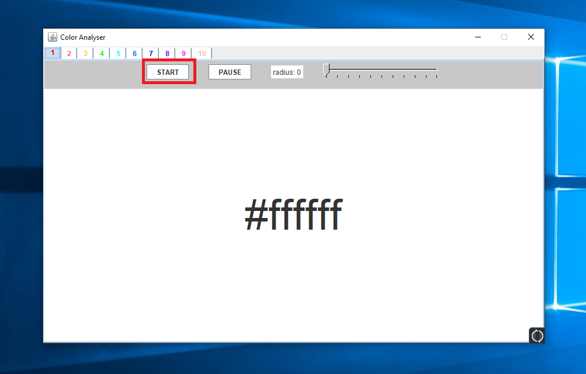
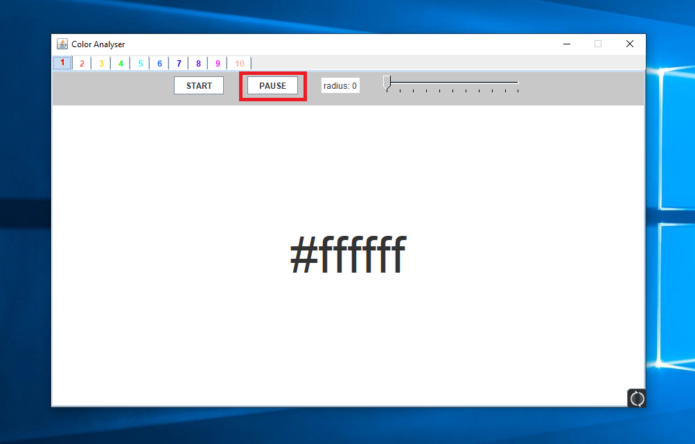
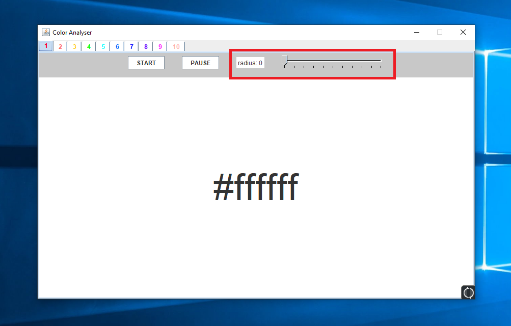
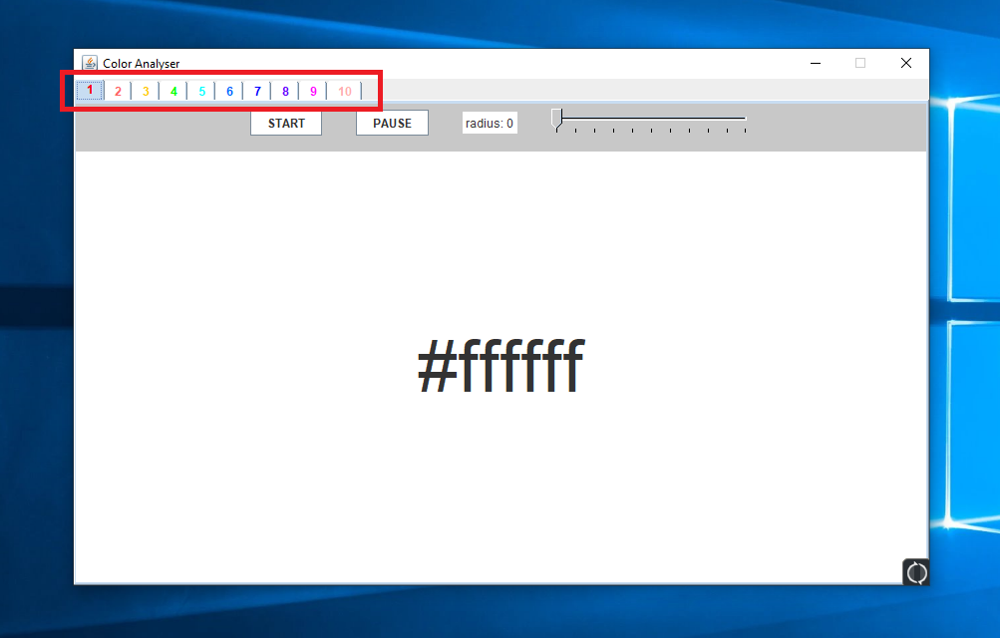

# Color Analyzing Tool

--- 

### General Information:

**This tool is created to assist when choosing a color.**

**It is designed to read the RGB-Value (e.g. #ff5688) at a specified position at the screen.**

---

### How To Execute:

To use the application follow the steps below:

1. Download the Repository
1. To execute, you can simply run the `ColorAnalyzer.jar`-File. 
   Alternatively, you can compile the Java-Files in the `src`-Folder.

### Different Features:

#### General Appearance:

This is how the application looks like.

You can hover over the position you want to read the color from with your mouse.
After that press, any key on your keyboard (preferably a letter or the SPACE-Key).

If it may not work after first starting the App, press the `START`-Button. (See below)

After scanning, the app may look similar to this:

#### The Color Code:

This is the Color Code:

It depicts the Color as a hexcode, describing the Red-, Green- and Blue-Value.
The `#` is not necessary, but often used to represent this color-coding.
The first two character after the `#` represent the red-value. The Two after the green-value, and the last two character represent the blue-value. 

#### The Start-Button:

The `START`-Button looks like this:

After starting the application, it is sometimes needed to press this button.
This button is also used to start the scanning-process after it was paused.

#### The Pause-Button:

The `PAUSE`-Button looks like this:

The button is used to stop the scanning purpose. The main-reason for this is the ability to copy the Color-Code afterwards with `CTRL + C`. Otherwise the application would scan again after presseng `CTRL`.

#### The Scanning Radius:

The Scanning Radius is controlled over this slider:

Normally the application would scan only one pixel, but with a radius of 'r', we scan a square of '2r + 1' and put out the average color.

Be aware that it may take a bit longer to scan if you use a bigger radius.

On the left of the slider, we can read which radius is currently used.

#### The different Tabs:

We have 10 Tabs available to scan different colors:

We can use the different tabs to scan a color and switch to a new tab to scan the next color.

Afterwards we have both colors available in the application.

