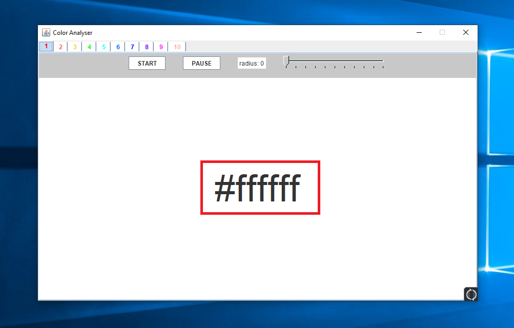

# Color Analyzing Tool

--- 

### General Information:

**This tool is created to assist when choosing a color.**

**It is designed to read the RGB-Value (e.g. #ff5688) at a specified position at the screen.**

---

### How To Execute:

To use the application follow the steps below:

1. Download the Repository
1. To execute, you can simply run the `ColorAnalyzer.jar`-File. 
   Alternatively, you can compile the Java-Files in the `src`-Folder.

### Different Features:

This is how the application looks like:

Explanation:
  Start the App and press START
  then you can scan a color by moving your cursor and pressing a letter-key on your keyboard
  press PAUSE to pause the scanning to press CTRL-C, after that you have to press START again
  To scan multiple Colors you can use the different tabs
